# Enterprise FizzBuzz Platform: Architecture Overview

## 1. Introduction

The Enterprise FizzBuzz Platform (EFP) is a production-grade FizzBuzz evaluation engine built on hexagonal architecture principles. The platform computes `n % 3` and `n % 5` through a pipeline of twelve middleware components, four evaluation strategies, a five-tier RBAC system, a MESI-coherent cache, a circuit breaker with exponential backoff, a distributed tracing subsystem, an event sourcing journal, an SLA monitor, a chaos engineering framework, a feature flag engine with dependency graphs, and a blockchain-based audit ledger. This document describes how these components are structured, how they interact, and where to find them in the codebase.

## 2. Hexagonal Layer Structure

The platform follows Ports & Adapters (hexagonal) architecture with strict inward-only dependency rules. The `domain` layer depends on nothing. The `application` layer depends on the `domain`. The `infrastructure` layer depends on both, but neither inner layer ever imports from `infrastructure`.

### 2.1 Directory Tree

```
enterprise_fizzbuzz/
├── __init__.py
├── __main__.py                              # Composition root: CLI, argument parsing, full wiring
│
├── domain/                                  # Pure domain — zero external dependencies
│   ├── __init__.py
│   ├── exceptions.py                        # 69 custom exception classes (EFP-xxxx error codes)
│   ├── interfaces.py                        # 10 abstract base classes (IRule, IRuleEngine, IMiddleware, etc.)
│   └── models.py                            # Enums, value objects, dataclasses (EventType: 74 members)
│
├── application/                             # Use cases, ports, service orchestration
│   ├── __init__.py
│   ├── factory.py                           # StandardRuleFactory, ConfigurableRuleFactory, CachingRuleFactory
│   ├── fizzbuzz_service.py                  # FizzBuzzService, FizzBuzzServiceBuilder, FizzBuzzSession
│   └── ports.py                             # StrategyPort (ACL), AbstractRepository, AbstractUnitOfWork
│
└── infrastructure/                          # Adapters, engines, middleware, external concerns
    ├── __init__.py
    ├── adapters/
    │   ├── __init__.py
    │   └── strategy_adapters.py             # Anti-Corruption Layer: 4 strategy adapters + factory
    ├── auth.py                              # RBAC: PermissionParser, RoleRegistry, TokenEngine, 47-field denial
    ├── blockchain.py                        # Proof-of-work blockchain audit ledger
    ├── cache.py                             # MESI-coherent cache with eulogies for evicted entries
    ├── chaos.py                             # ChaosMonkey, fault injection, Game Day scenarios, post-mortems
    ├── circuit_breaker.py                   # Circuit breaker state machine, sliding window, backoff, dashboard
    ├── config.py                            # ConfigurationManager (YAML + env vars + CLI precedence)
    ├── container.py                         # Dependency injection container (coexists with builder)
    ├── event_sourcing.py                    # CQRS command/query bus, event store, temporal queries, snapshots
    ├── feature_flags.py                     # Flag store, dependency DAG, percentage rollout, targeting rules
    ├── formatters.py                        # Plain, JSON, XML, CSV output formatters
    ├── i18n.py                              # LocaleManager, .fizztranslation parser, 7 locales
    ├── middleware.py                        # Core middleware: Validation, Timing, Logging, Translation, Pipeline
    ├── migrations.py                        # Schema manager, migration runner, seed data generator
    ├── ml_engine.py                         # Neural network FizzBuzz evaluator (MLP with cyclical encoding)
    ├── observers.py                         # EventBus, ConsoleObserver, StatisticsObserver
    ├── plugins.py                           # PluginRegistry for third-party rule extensions
    ├── rules_engine.py                      # StandardRuleEngine, ChainOfResponsibilityEngine, ParallelAsyncEngine
    ├── sla.py                               # SLO definitions, error budgets, alerting, on-call schedule
    ├── persistence/
    │   ├── __init__.py
    │   ├── in_memory.py                     # InMemoryRepository, InMemoryUnitOfWork
    │   ├── sqlite.py                        # SqliteRepository, SqliteUnitOfWork
    │   └── filesystem.py                    # FileSystemRepository, FileSystemUnitOfWork
    └── utils/
        ├── __init__.py
        └── loc.py                           # Lines-of-code counter
```

### 2.2 Dependency Rule

Dependencies flow inward only:

- **`domain/`** imports nothing from `application/` or `infrastructure/`. It defines the ABCs (`IRule`, `IRuleEngine`, `IMiddleware`, `IObserver`, `IEventBus`, `IFormatter`, `IPlugin`, `ITranslatable`, `IFizzBuzzService`) and value objects (`FizzBuzzResult`, `ProcessingContext`, `Event`, `RuleDefinition`, `EvaluationResult`) that the rest of the system programs against.
- **`application/`** imports from `domain/` only. It defines the `StrategyPort` and `AbstractRepository`/`AbstractUnitOfWork` ports, and contains the `FizzBuzzService` which orchestrates domain interfaces without knowing their concrete implementations.
- **`infrastructure/`** imports from both `domain/` and `application/`. It provides all concrete implementations: rule engines, middleware, observers, formatters, persistence backends, and every subsystem described in this document.
- **`__main__.py`** is the composition root. It wires everything together, creating concrete instances and injecting them into the service builder. It is the only module permitted to import from all three layers simultaneously.

## 3. Request Lifecycle: Tracing the Number 15

The following trace follows the number 15 through the full evaluation pipeline with all subsystems enabled, from CLI argument to final output. Every class and method is named in order.

### 3.1 CLI Parsing and Configuration

1. `__main__.main()` is invoked. `build_argument_parser()` constructs the `argparse.ArgumentParser` with all flags. Arguments are parsed.
2. `ConfigurationManager.__init__()` and `ConfigurationManager.load()` read `config.yaml`, apply environment variable overrides (`EFP_*`), and merge with CLI flags. Precedence: CLI > env var > YAML > hardcoded default.
3. `EventBus.__init__()` creates the thread-safe event bus. `StatisticsObserver.__init__()` is instantiated and subscribed via `EventBus.subscribe()`.

### 3.2 Service Construction

4. `FizzBuzzServiceBuilder()` is created. The builder accumulates dependencies via fluent method calls:
   - `.with_config(config)` — injects the `ConfigurationManager`
   - `.with_event_bus(event_bus)` — injects the `EventBus`
   - `.with_rule_engine(rule_engine)` — injects a `StandardRuleEngine` (or whichever strategy was selected, created by `RuleEngineFactory.create()`)
   - `.with_output_format(output_format)` — sets the `OutputFormat` enum
   - `.with_default_middleware()` — adds `ValidationMiddleware`, `TimingMiddleware`, `LoggingMiddleware`
   - Optional: `.with_middleware(...)` for each enabled subsystem (tracing, auth, translation, event sourcing, circuit breaker, cache, chaos, SLA, feature flags)
5. `FizzBuzzServiceBuilder.build()` resolves the rule factory chain: `ConfigurableRuleFactory` wrapped in `CachingRuleFactory`. Creates the default rules (`FizzRule` divisor=3, `BuzzRule` divisor=5) via `IRuleFactory.create_default_rules()`. Instantiates `MiddlewarePipeline` and adds all middleware, sorted by priority. Returns a fully wired `FizzBuzzService`.
6. `StrategyAdapterFactory.create()` wraps the rule engine in the appropriate Anti-Corruption Layer adapter (e.g., `StandardStrategyAdapter`). The adapter is injected into the service as `service._strategy_port`.

### 3.3 Execution

7. `FizzBuzzService.run(1, 20)` is called. It creates a `FizzBuzzSession` via `FizzBuzzService.create_session()`.
8. `FizzBuzzSession.__enter__()` publishes `EventType.SESSION_STARTED` on the event bus.
9. `FizzBuzzSession.run(1, 20)` delegates to `FizzBuzzService._execute(1, 20, session_id)`.
10. For each number in the range (including 15), a `ProcessingContext` is created with `number=15`, `session_id`, and the accumulating `results` list.
11. `MiddlewarePipeline.execute(context, evaluate)` builds the middleware chain via `build_chain()`. The chain is a nested series of closures, sorted by priority, with the `evaluate` function as the innermost handler.

### 3.4 Middleware Pipeline (number 15)

The number 15 passes through each middleware in priority order. On the way in, each middleware may inspect or modify the context. On the way out (after `next_handler` returns), each may inspect or modify the result.

| Order | Priority | Middleware | Inbound Action | Outbound Action |
|-------|----------|------------|----------------|-----------------|
| 1 | -10 | `AuthorizationMiddleware` | Constructs `Permission("numbers", "15", "evaluate")` and checks against `AuthContext.effective_permissions` | Adds `auth_user`, `auth_role` to metadata |
| 2 | -3 | `FlagMiddleware` | Evaluates all flags via `FlagStore.evaluate_all(15)`, stores active/disabled rule labels in `context.metadata` | None |
| 3 | -1 | `CircuitBreakerMiddleware` | Checks circuit state; if OPEN, raises `CircuitOpenError`; if HALF_OPEN, limits probe calls | Records success/failure in `SlidingWindow` |
| 5 | 0 | `ValidationMiddleware` | Validates `context.number` is an `int` within `[-2^31, 2^31-1]` and not cancelled | None |
| 6 | 1 | `TimingMiddleware` | Sets `context.start_time`, captures `perf_counter_ns()` | Sets `context.end_time`, records `processing_time_ns` and `processing_time_ms` in metadata |
| 7 | 2 | `LoggingMiddleware` | Logs `"Processing number: 15"` at configured level | Logs result output and matched rule count |
| 8 | 3 | `ChaosMiddleware` | Rolls dice against `ChaosMonkey.should_inject()`; may inject latency, corrupt results, or throw exceptions | Records fault data in context metadata |
| 9 | 4 | `CacheMiddleware` | Checks `CacheStore` for a cached result for 15; on HIT, returns immediately without calling `next_handler` | On MISS, stores the result in `CacheStore` with MESI state EXCLUSIVE |
| 10 | 5 | `EventSourcingMiddleware` | Dispatches `EvaluateNumberCommand(15)` through the `CommandBus` | Records domain events in the append-only event store |
| 11 | 50 | `TranslationMiddleware` | None (passes through to next handler first) | Translates output labels ("FizzBuzz") to the active locale via `LocaleManager.get_label()` |
| 12 | 55 | `SLAMiddleware` | None (passes through first) | Records latency in `SLAMonitor`, checks accuracy against ground truth, fires alerts on SLO violations |

### 3.5 Core Evaluation (the innermost handler)

12. The `evaluate` closure inside `FizzBuzzService._execute()` is reached. If feature flags are active and have disabled any rule labels, those rules are filtered out.
13. With the ACL active: `StrategyPort.classify(15)` is called on the strategy adapter (e.g., `StandardStrategyAdapter.classify(15)`).
14. The adapter calls `IRuleEngine.evaluate(15, rules)` — specifically `StandardRuleEngine.evaluate(15, [FizzRule, BuzzRule])`.
15. `StandardRuleEngine` sorts rules by priority and iterates. `FizzRule` (divisor=3): `15 % 3 == 0` is `True` — match. `BuzzRule` (divisor=5): `15 % 5 == 0` is `True` — match. Two `RuleMatch` objects are created.
16. The engine concatenates matched labels: `"Fizz" + "Buzz"` = `"FizzBuzz"`. Returns `FizzBuzzResult(number=15, output="FizzBuzz", matched_rules=[FizzRule, BuzzRule])`.
17. The adapter calls `_classify_result(result)`, which inspects `is_fizz` and `is_buzz` properties and returns `FizzBuzzClassification.FIZZBUZZ`.
18. Back in `FizzBuzzService._execute()`, the `EvaluationResult` is converted back to `FizzBuzzResult` via `_evaluation_result_to_fizzbuzz_result()` (reconstructing `matched_rules` from the classification). The result is appended to `context.results`.
19. `FizzBuzzService._emit_result_events(result)` publishes `EventType.NUMBER_PROCESSED` and `EventType.FIZZBUZZ_DETECTED` on the event bus. `StatisticsObserver.on_event()` increments its counters.

### 3.6 Output

20. After all numbers are processed, `FizzBuzzService._build_summary()` constructs a `FizzBuzzSessionSummary`.
21. If a `AbstractUnitOfWork` is configured, all results are persisted via `AbstractRepository.add()` and `AbstractUnitOfWork.commit()`.
22. `FizzBuzzSession.__exit__()` publishes `EventType.SESSION_ENDED`.
23. `FizzBuzzService.format_results(results)` delegates to the configured `IFormatter` (e.g., `PlainTextFormatter.format_results()`). The number 15 is rendered as `"FizzBuzz"`.

## 4. Middleware Pipeline

The `MiddlewarePipeline` (defined in `enterprise_fizzbuzz/infrastructure/middleware.py`) maintains an ordered list of `IMiddleware` instances sorted by `get_priority()` (lower numbers execute first). When `execute()` is called, it builds a chain of closures via `build_chain()` and invokes the outermost one.

### 4.1 Middleware Priority Table

| Priority | Middleware Class | Module | Description |
|----------|-----------------|--------|-------------|
| -10 | `AuthorizationMiddleware` | `infrastructure/auth.py` | RBAC enforcement. Checks user permissions against each number. Builds the 47-field denial response on failure. |
| -3 | `FlagMiddleware` | `infrastructure/feature_flags.py` | Feature flag evaluation. Runs `FlagStore.evaluate_all()` and stores active/disabled rule labels in context metadata. |
| -1 | `CircuitBreakerMiddleware` | `infrastructure/circuit_breaker.py` | Fault tolerance. Routes evaluation through the `CircuitBreaker` state machine (CLOSED/OPEN/HALF_OPEN). |
| 0 | `ValidationMiddleware` | `infrastructure/middleware.py` | Input validation. Rejects non-integers and out-of-range numbers. Checks `context.cancelled`. |
| 1 | `TimingMiddleware` | `infrastructure/middleware.py` | Performance measurement. Records nanosecond-precision timing in context metadata. |
| 2 | `LoggingMiddleware` | `infrastructure/middleware.py` | Pipeline observability. Logs each number entering and its result exiting the pipeline. |
| 3 | `ChaosMiddleware` | `infrastructure/chaos.py` | Fault injection. Runs inside the circuit breaker so injected failures trigger circuit trips. May add latency, corrupt results, or throw `ChaosInducedFizzBuzzError`. |
| 4 | `CacheMiddleware` | `infrastructure/cache.py` | Result caching. On HIT, short-circuits the pipeline and returns the cached `FizzBuzzResult`. On MISS, caches the result after evaluation. Manages MESI coherence states. |
| 5 | `EventSourcingMiddleware` | `infrastructure/event_sourcing.py` | CQRS integration. Routes evaluations through the `CommandBus` and records domain events in the event store. |
| 50 | `TranslationMiddleware` | `infrastructure/middleware.py` | Internationalization. Replaces English labels with locale-appropriate equivalents via `LocaleManager`. Runs late so it translates final output. |
| 55 | `SLAMiddleware` | `infrastructure/sla.py` | SLA monitoring. Records latency, checks accuracy, updates error budgets, fires alerts. Runs after core evaluation but before output rendering. |

### 4.2 Pipeline Ordering Rationale

The priority scheme follows a deliberate design:

- **Negative priorities (-10 through -1)**: Security and infrastructure concerns that must execute before any business logic. OTel tracing runs first at -10 to capture everything. Then authorization (no point evaluating if the user lacks permission), then feature flags (determine which rules are active), then circuit breaker (reject early if the system is degraded).
- **Zero through 5**: Core processing concerns. Validation ensures input sanity. Timing wraps the evaluation for performance data. Logging provides observability. Chaos runs inside the circuit breaker intentionally. Caching short-circuits before the expensive evaluation. Event sourcing captures the raw result.
- **50 and above**: Post-processing concerns. Translation must run after all middleware have finalized the output string. SLA monitoring measures the completed evaluation latency.

## 5. Event System

### 5.1 EventBus Architecture

The `EventBus` (defined in `enterprise_fizzbuzz/infrastructure/observers.py`) implements a thread-safe publish/subscribe pattern. It maintains an ordered list of `IObserver` instances and a complete `_event_history` list.

**Publication flow:**
1. A component creates an `Event` dataclass with an `EventType`, payload dict, timestamp, unique `event_id`, and source string.
2. `EventBus.publish(event)` acquires the lock, appends the event to `_event_history`, takes a snapshot of the observer list, then releases the lock.
3. Each observer's `on_event(event)` is called in registration order. Exceptions in individual observers are caught and logged without affecting other observers.

### 5.2 Event Types

The `EventType` enum (defined in `enterprise_fizzbuzz/domain/models.py`) has 74 members organized into the following categories:

| Category | Event Types | Count |
|----------|-------------|-------|
| Session lifecycle | `SESSION_STARTED`, `SESSION_ENDED` | 2 |
| Number processing | `NUMBER_PROCESSING_STARTED`, `NUMBER_PROCESSED` | 2 |
| Rule evaluation | `RULE_MATCHED`, `RULE_NOT_MATCHED` | 2 |
| Classification | `FIZZ_DETECTED`, `BUZZ_DETECTED`, `FIZZBUZZ_DETECTED`, `PLAIN_NUMBER_DETECTED` | 4 |
| Middleware | `MIDDLEWARE_ENTERED`, `MIDDLEWARE_EXITED` | 2 |
| Output | `OUTPUT_FORMATTED` | 1 |
| Errors | `ERROR_OCCURRED` | 1 |
| Circuit breaker | `CIRCUIT_BREAKER_STATE_CHANGED`, `_TRIPPED`, `_RECOVERED`, `_HALF_OPEN`, `_CALL_REJECTED` | 5 |
| Tracing | `TRACE_STARTED`, `TRACE_ENDED`, `SPAN_STARTED`, `SPAN_ENDED` | 4 |
| Authorization | `AUTHORIZATION_GRANTED`, `AUTHORIZATION_DENIED`, `TOKEN_VALIDATED`, `TOKEN_VALIDATION_FAILED` | 4 |
| Event sourcing | `ES_NUMBER_RECEIVED`, `ES_DIVISIBILITY_CHECKED`, `ES_RULE_MATCHED`, `ES_LABEL_ASSIGNED`, `ES_EVALUATION_COMPLETED`, `ES_SNAPSHOT_TAKEN`, `ES_COMMAND_DISPATCHED`, `ES_COMMAND_HANDLED`, `ES_QUERY_DISPATCHED`, `ES_PROJECTION_UPDATED`, `ES_EVENT_REPLAYED`, `ES_TEMPORAL_QUERY_EXECUTED` | 12 |
| Chaos engineering | `CHAOS_MONKEY_ACTIVATED`, `CHAOS_FAULT_INJECTED`, `CHAOS_RESULT_CORRUPTED`, `CHAOS_LATENCY_INJECTED`, `CHAOS_EXCEPTION_INJECTED`, `CHAOS_GAMEDAY_STARTED`, `CHAOS_GAMEDAY_ENDED` | 7 |
| Feature flags | `FLAG_EVALUATED`, `FLAG_STATE_CHANGED`, `FLAG_DEPENDENCY_RESOLVED`, `FLAG_ROLLOUT_DECISION` | 4 |
| SLA monitoring | `SLA_EVALUATION_RECORDED`, `SLA_SLO_CHECKED`, `SLA_SLO_VIOLATION`, `SLA_ALERT_FIRED`, `SLA_ALERT_ACKNOWLEDGED`, `SLA_ALERT_RESOLVED`, `SLA_ERROR_BUDGET_UPDATED`, `SLA_ERROR_BUDGET_EXHAUSTED` | 8 |
| Anti-Corruption Layer | `CLASSIFICATION_AMBIGUITY`, `STRATEGY_DISAGREEMENT` | 2 |
| Cache | `CACHE_HIT`, `CACHE_MISS`, `CACHE_EVICTION`, `CACHE_INVALIDATION`, `CACHE_WARMING`, `CACHE_COHERENCE_TRANSITION`, `CACHE_EULOGY_COMPOSED` | 7 |
| Repository | `REPOSITORY_RESULT_ADDED`, `REPOSITORY_COMMITTED`, `REPOSITORY_ROLLED_BACK`, `ROLLBACK_FILE_DELETED` | 4 |
| Migrations | `MIGRATION_STARTED`, `MIGRATION_APPLIED`, `MIGRATION_ROLLED_BACK`, `MIGRATION_FAILED`, `MIGRATION_SEED_STARTED`, `MIGRATION_SEED_COMPLETED`, `MIGRATION_SCHEMA_CHANGED` | 7 |

### 5.3 Observers

| Observer | Module | Subscribes To | Behavior |
|----------|--------|---------------|----------|
| `StatisticsObserver` | `infrastructure/observers.py` | `FIZZ_DETECTED`, `BUZZ_DETECTED`, `FIZZBUZZ_DETECTED`, `PLAIN_NUMBER_DETECTED`, `NUMBER_PROCESSED`, `ERROR_OCCURRED` | Maintains running counts for session summary generation. Thread-safe via `threading.Lock`. |
| `ConsoleObserver` | `infrastructure/observers.py` | All (filtered) | Prints events to stdout in real-time. In non-verbose mode, only prints classification events and errors. |
| `BlockchainObserver` | `infrastructure/blockchain.py` | `NUMBER_PROCESSED` | Mines a new block for each evaluation result, adding it to the proof-of-work blockchain ledger. |

Additional subsystems act as implicit observers by receiving events through the `EventBus` passed to their constructors (e.g., `SLAMonitor`, `ChaosMonkey`, `CircuitBreaker`).

## 6. Dependency Graph

```mermaid
graph TD
    CLI["__main__.py<br/>(Composition Root)"]

    CLI --> Config["ConfigurationManager"]
    CLI --> Builder["FizzBuzzServiceBuilder"]
    CLI --> EventBus["EventBus"]

    Builder --> Service["FizzBuzzService"]
    Builder --> Pipeline["MiddlewarePipeline"]
    Builder --> Formatter["IFormatter"]
    Builder --> RuleFactory["CachingRuleFactory"]
    Builder --> RuleEngine["IRuleEngine"]

    Service --> Pipeline
    Service --> EventBus
    Service --> ACL["StrategyPort<br/>(Anti-Corruption Layer)"]
    Service --> UoW["AbstractUnitOfWork"]

    ACL --> RuleEngine
    ACL --> |"adapts"| Adapters["StandardStrategyAdapter<br/>ChainStrategyAdapter<br/>AsyncStrategyAdapter<br/>MLStrategyAdapter"]

    Pipeline --> AuthMW["AuthorizationMiddleware"]
    Pipeline --> FlagMW["FlagMiddleware"]
    Pipeline --> OTelMW["OTelMiddleware"]
    Pipeline --> CBMW["CircuitBreakerMiddleware"]
    Pipeline --> ValMW["ValidationMiddleware"]
    Pipeline --> TimeMW["TimingMiddleware"]
    Pipeline --> LogMW["LoggingMiddleware"]
    Pipeline --> ChaosMW["ChaosMiddleware"]
    Pipeline --> CacheMW["CacheMiddleware"]
    Pipeline --> ESMW["EventSourcingMiddleware"]
    Pipeline --> TransMW["TranslationMiddleware"]
    Pipeline --> SLAMW["SLAMiddleware"]

    AuthMW --> RoleRegistry["RoleRegistry"]
    AuthMW --> TokenEngine["FizzBuzzTokenEngine"]
    AuthMW --> DenialBuilder["AccessDeniedResponseBuilder"]

    FlagMW --> FlagStore["FlagStore"]
    FlagStore --> DepGraph["FlagDependencyGraph"]
    FlagStore --> Rollout["RolloutStrategy"]

    OTelMW --> TracerProvider["TracerProvider"]

    CBMW --> CircuitBreaker["CircuitBreaker"]
    CircuitBreaker --> SlidingWindow["SlidingWindow"]
    CircuitBreaker --> Backoff["ExponentialBackoffCalculator"]

    ChaosMW --> ChaosMonkey["ChaosMonkey"]

    CacheMW --> CacheStore["CacheStore"]
    CacheStore --> EvictionPolicy["EvictionPolicy<br/>(LRU/LFU/FIFO/DramaticRandom)"]
    CacheStore --> EulogyComposer["CacheEulogyComposer"]

    ESMW --> ESSystem["EventSourcingSystem"]
    ESSystem --> CommandBus["CommandBus"]
    ESSystem --> EventStore["EventStore"]
    ESSystem --> TemporalEngine["TemporalQueryEngine"]

    TransMW --> LocaleMgr["LocaleManager"]

    SLAMW --> SLAMonitor["SLAMonitor"]
    SLAMonitor --> OnCall["OnCallSchedule"]

    UoW --> Repository["AbstractRepository"]
    Repository --> |"impl"| InMem["InMemoryRepository"]
    Repository --> |"impl"| SQLite["SqliteRepository"]
    Repository --> |"impl"| FileSystem["FileSystemRepository"]

    RuleEngine --> |"impl"| Standard["StandardRuleEngine"]
    RuleEngine --> |"impl"| Chain["ChainOfResponsibilityEngine"]
    RuleEngine --> |"impl"| Async["ParallelAsyncEngine"]
    RuleEngine --> |"impl"| ML["MachineLearningEngine"]

    EventBus --> StatsObs["StatisticsObserver"]
    EventBus --> ConsoleObs["ConsoleObserver"]
    EventBus --> BlockchainObs["BlockchainObserver"]

    Config --> |"reads"| YAML["config.yaml"]
```



## 7. Subsystem Activation Table

The following table lists every subsystem, its activation mechanism, and whether it runs unconditionally.

| Subsystem | Always On | CLI Flag(s) | Config Key | Description |
|-----------|-----------|-------------|------------|-------------|
| Rule engine (Standard) | Yes | `--strategy standard` | `evaluation.strategy` | Default evaluation strategy. Iterates rules sequentially. |
| Rule engine (Chain) | No | `--strategy chain_of_responsibility` | `evaluation.strategy` | Chain of Responsibility pattern for rule dispatch. |
| Rule engine (Async) | No | `--strategy parallel_async` | `evaluation.strategy` | Concurrent rule evaluation via asyncio. |
| Rule engine (ML) | No | `--strategy machine_learning` | `evaluation.strategy` | Neural network MLP with cyclical feature encoding. |
| Anti-Corruption Layer | Yes | — | — | Always active. Wraps the rule engine in a `StrategyPort` adapter. |
| Middleware: Validation | Yes | — | — | Added by `with_default_middleware()`. |
| Middleware: Timing | Yes | — | — | Added by `with_default_middleware()`. |
| Middleware: Logging | Yes | — | — | Added by `with_default_middleware()`. |
| Event bus | Yes | — | — | Always instantiated. `StatisticsObserver` always subscribed. |
| Console observer | No | `--verbose` / `-v` | — | Subscribes `ConsoleObserver` with `verbose=True`. |
| RBAC / Authorization | No | `--user`, `--token`, `--role` | `auth.enabled` | Enables `AuthorizationMiddleware` (priority -10). |
| Distributed tracing | No | `--trace`, `--trace-json`, `--otel` | `otel.*` | Enables `OTelMiddleware` (priority -10) and `TracerProvider`. `--trace` is an alias for `--otel --otel-export console`. |
| Circuit breaker | No | `--circuit-breaker` | `circuit_breaker.*` | Enables `CircuitBreakerMiddleware` (priority -1). |
| Circuit breaker dashboard | No | `--circuit-status` | — | Renders ASCII dashboard after execution. Requires `--circuit-breaker`. |
| Chaos engineering | No | `--chaos` | `chaos.*` | Enables `ChaosMiddleware` (priority 3) and `ChaosMonkey`. |
| Chaos level | No | `--chaos-level N` | `chaos.level` | Sets fault injection severity (1-5). |
| Game Day | No | `--gameday [SCENARIO]` | — | Runs a named chaos scenario. Implies `--chaos`. |
| Post-mortem | No | `--post-mortem` | — | Generates incident report after chaos execution. |
| Caching | No | `--cache` | `cache.*` | Enables `CacheMiddleware` (priority 4) and `CacheStore`. |
| Cache policy | No | `--cache-policy POLICY` | `cache.eviction_policy` | Selects eviction policy (lru, lfu, fifo, dramatic_random). |
| Cache warming | No | `--cache-warm` | — | Pre-populates cache for the evaluation range. Requires `--cache`. |
| Cache dashboard | No | `--cache-stats` | — | Renders cache statistics dashboard. Requires `--cache`. |
| Event sourcing / CQRS | No | `--event-sourcing` | `event_sourcing.*` | Enables `EventSourcingMiddleware` (priority 5). |
| Event replay | No | `--replay` | — | Replays all events to rebuild projections. Requires `--event-sourcing`. |
| Temporal queries | No | `--temporal-query SEQ` | — | Reconstructs state at a given event sequence. Requires `--event-sourcing`. |
| Feature flags | No | `--feature-flags` | `feature_flags.*` | Enables `FlagMiddleware` (priority -3) and `FlagStore`. |
| Flag overrides | No | `--flag NAME=VALUE` | — | Overrides individual flag values. Requires `--feature-flags`. |
| Flag listing | No | `--list-flags` | — | Displays all registered flags and exits. Requires `--feature-flags`. |
| SLA monitoring | No | `--sla` | `sla.*` | Enables `SLAMiddleware` (priority 55) and `SLAMonitor`. |
| SLA dashboard | No | `--sla-dashboard` | — | Renders SLA monitoring dashboard. Requires `--sla`. |
| On-call status | No | `--on-call` | — | Displays on-call schedule and escalation chain. |
| Internationalization | Conditional | `--locale LOCALE` | `i18n.enabled`, `i18n.locale` | Enables `TranslationMiddleware` (priority 50) when `i18n.enabled` is true. |
| Locale listing | No | `--list-locales` | — | Displays available locales and exits. |
| Blockchain audit | No | `--blockchain` | — | Subscribes `BlockchainObserver` to the event bus for proof-of-work logging. |
| Mining difficulty | No | `--mining-difficulty N` | — | Sets proof-of-work difficulty for blockchain. |
| Repository persistence | No | `--repository BACKEND` | `repository.backend` | Enables result persistence via `AbstractUnitOfWork` (in_memory, sqlite, filesystem). |
| Database migrations | No | `--migrate` | — | Applies schema migrations to the in-memory database. |
| Migration dashboard | No | `--migrate-status` | — | Displays migration status. |
| Migration rollback | No | `--migrate-rollback [N]` | — | Rolls back the last N migrations. |
| Seed data | No | `--migrate-seed` | — | Generates FizzBuzz seed data using the FizzBuzz engine. |
| Output format | Yes | `--format {plain,json,xml,csv}` | `output.format` | Controls output serialization. Default: plain. |
| Async execution | No | `--async` | — | Uses `run_async()` instead of `run()`. |

## 8. Anti-Corruption Layer

The Anti-Corruption Layer (ACL) is defined in `enterprise_fizzbuzz/infrastructure/adapters/strategy_adapters.py` and provides a clean boundary between the domain model and the evaluation engines. Its purpose is to prevent engine-specific concerns — such as ML confidence scores or chain link traversal metadata — from leaking into the domain's `FizzBuzzResult` type.

### 8.1 How It Works

1. The `StrategyPort` abstract class (defined in `application/ports.py`) declares a single method: `classify(number: int) -> EvaluationResult`. The `EvaluationResult` is a frozen dataclass containing the number, a `FizzBuzzClassification` enum value, and the strategy name.

2. Four concrete adapters implement `StrategyPort`:
   - `StandardStrategyAdapter` — wraps `StandardRuleEngine`
   - `ChainStrategyAdapter` — wraps `ChainOfResponsibilityEngine`
   - `AsyncStrategyAdapter` — wraps `ParallelAsyncEngine`
   - `MLStrategyAdapter` — wraps `MachineLearningEngine`, adds ambiguity detection and optional cross-strategy disagreement tracking

3. Each adapter calls `IRuleEngine.evaluate()` internally, then maps the result to `FizzBuzzClassification` via the `_classify_result()` helper, which inspects the `is_fizz` and `is_buzz` properties on `FizzBuzzResult`.

4. Back in `FizzBuzzService._execute()`, the `EvaluationResult` is converted back to a `FizzBuzzResult` via `_evaluation_result_to_fizzbuzz_result()`. This reverse translation reconstructs `matched_rules` from the classification so that the middleware pipeline receives the type it expects.

5. `StrategyAdapterFactory.create()` handles adapter instantiation, including lazy import of the ML engine and optional wiring of a reference strategy for disagreement tracking.

### 8.2 ML Adapter Specifics

The `MLStrategyAdapter` performs two additional checks beyond classification:

- **Ambiguity detection**: If any rule's ML confidence score falls within `[threshold - margin, threshold + margin]`, a `CLASSIFICATION_AMBIGUITY` event is published. The default threshold is 0.5 and margin is 0.1.
- **Disagreement tracking**: When `enable_disagreement_tracking` is true, the adapter creates a `StandardStrategyAdapter` as a reference and compares classifications. Disagreements are published as `STRATEGY_DISAGREEMENT` events.

## 9. Key Design Patterns

| Pattern | Where Used | Implementation |
|---------|-----------|----------------|
| Hexagonal Architecture | Entire codebase | `domain/` (core), `application/` (ports/use cases), `infrastructure/` (adapters) |
| Builder | `FizzBuzzServiceBuilder` | Fluent API for constructing `FizzBuzzService` with injected dependencies |
| Strategy | `IRuleEngine` + `RuleEngineFactory` | Four interchangeable evaluation strategies behind a common interface |
| Anti-Corruption Layer | `StrategyPort` + `*StrategyAdapter` | Translates `FizzBuzzResult` to `EvaluationResult` and back, isolating engine-specific concerns |
| Middleware Pipeline | `MiddlewarePipeline` + `IMiddleware` | Composable chain of handlers with priority-based ordering |
| Observer / Pub-Sub | `EventBus` + `IObserver` | Thread-safe event publication with error-isolated subscriber notification |
| Circuit Breaker | `CircuitBreaker` + `CircuitBreakerMiddleware` | Three-state machine with sliding window failure tracking and exponential backoff |
| Chain of Responsibility | `ChainOfResponsibilityEngine` + `ChainLink` | Linked list of rule handlers for sequential evaluation |
| Singleton | `CircuitBreakerRegistry`, `ChaosMonkey` | Thread-safe singletons with reset capability for testing |
| Repository + Unit of Work | `AbstractRepository` + `AbstractUnitOfWork` | Transactional persistence with three backend implementations |
| Factory | `RuleEngineFactory`, `FormatterFactory`, `EvictionPolicyFactory`, `StrategyAdapterFactory` | Centralized object creation with strategy/configuration dispatch |
| CQRS | `CommandBus` + `EventStore` | Command/query segregation for event-sourced evaluation history |
| State Machine | `CircuitBreaker`, `FlagLifecycle`, `CacheCoherenceState` | Formal state transitions with validation and event emission |
| Decorator | `@traced` | Zero-overhead tracing instrumentation when provider is None, automatic span lifecycle via FizzOTel when active |
| Plugin | `IPlugin` + `PluginRegistry` | Extension point for third-party rule definitions |
| Dependency Injection Container | `Container` | Registration-based IoC container with lifetime management (coexists with builder) |

## 10. Evaluation Strategies

The platform supports four evaluation strategies, selectable via `--strategy` or `evaluation.strategy` in `config.yaml`. All strategies implement `IRuleEngine` and are instantiated by `RuleEngineFactory.create()` in `enterprise_fizzbuzz/infrastructure/rules_engine.py`.

| Strategy | Class | How It Works |
|----------|-------|-------------|
| `STANDARD` | `StandardRuleEngine` | Sorts rules by priority, iterates sequentially, collects all matches. Concatenates matched labels. The approach that any reasonable person would use. |
| `CHAIN_OF_RESPONSIBILITY` | `ChainOfResponsibilityEngine` | Builds a linked list of `ChainLink` objects from the sorted rules. Each link evaluates its rule and passes the number to the next link regardless of match status. All matches are collected. |
| `PARALLEL_ASYNC` | `ParallelAsyncEngine` | Creates an `asyncio` task per rule, gathers results concurrently. Sorts matches by priority after gathering. The synchronous fallback delegates to `StandardRuleEngine` because concurrent modulo is an aspirational goal. |
| `MACHINE_LEARNING` | `MachineLearningEngine` | A from-scratch multi-layer perceptron with cyclical feature encoding (`sin(2*pi*n/d)`, `cos(2*pi*n/d)` for each divisor). Trains on a generated dataset at initialization. Achieves 100% accuracy with 130 trainable parameters. |

## 11. Domain Interfaces

All abstract contracts are defined in `enterprise_fizzbuzz/domain/interfaces.py`. The following table summarizes each interface and its known implementations.

| Interface | Methods | Implementations |
|-----------|---------|-----------------|
| `IRule` | `evaluate(number) -> bool`, `get_definition() -> RuleDefinition` | `ConcreteRule` |
| `IRuleFactory` | `create_rule(definition) -> IRule`, `create_default_rules() -> list[IRule]` | `StandardRuleFactory`, `ConfigurableRuleFactory`, `CachingRuleFactory` |
| `IRuleEngine` | `evaluate(number, rules) -> FizzBuzzResult`, `evaluate_async(number, rules) -> FizzBuzzResult` | `StandardRuleEngine`, `ChainOfResponsibilityEngine`, `ParallelAsyncEngine`, `MachineLearningEngine` |
| `IObserver` | `on_event(event)`, `get_name() -> str` | `ConsoleObserver`, `StatisticsObserver`, `BlockchainObserver` |
| `IEventBus` | `subscribe(observer)`, `unsubscribe(observer)`, `publish(event)` | `EventBus` |
| `IMiddleware` | `process(context, next_handler) -> ProcessingContext`, `get_name() -> str`, `get_priority() -> int` | 12 implementations (see Middleware Priority Table) |
| `IFormatter` | `format_result(result) -> str`, `format_results(results) -> str`, `format_summary(summary) -> str`, `get_format_type() -> OutputFormat` | `PlainTextFormatter`, `JsonFormatter`, `XmlFormatter`, `CsvFormatter` |
| `IPlugin` | `initialize(config)`, `get_name() -> str`, `get_version() -> str`, `get_rules() -> list[RuleDefinition]` | (Extension point for third-party plugins) |
| `ITranslatable` | `translate(key, locale, **kwargs) -> str`, `get_supported_locales() -> list[str]` | `LocaleManager` |
| `IFizzBuzzService` | `run(start, end) -> list[FizzBuzzResult]`, `run_async(start, end) -> list[FizzBuzzResult]`, `get_summary() -> FizzBuzzSessionSummary` | `FizzBuzzService` |

## 12. Composition Root

The composition root lives in `enterprise_fizzbuzz/__main__.py`. The `main()` function is responsible for:

1. Parsing all CLI arguments via `build_argument_parser()` (40+ flags)
2. Loading configuration via `ConfigurationManager`
3. Creating and wiring the `EventBus` with observers
4. Setting up optional subsystems based on CLI flags (each guarded by an `if` block)
5. Constructing the service via `FizzBuzzServiceBuilder` with all dependencies injected
6. Wiring the Anti-Corruption Layer via `StrategyAdapterFactory.create()`
7. Executing the evaluation via `FizzBuzzService.run()` or `run_async()`
8. Rendering output, dashboards, traces, post-mortems, and summaries
9. Returning exit code 0 on success, 1 on authentication failure

The composition root is the only place where all three architectural layers are imported simultaneously. It is 1,170 lines long, because wiring together an enterprise FizzBuzz platform is not a task that can be accomplished in fewer.

### 12.1 Wiring Order

The subsystems are wired in a specific order within `main()`, dictated by their interdependencies:

1. **Configuration** — must be first; everything reads from it.
2. **Event bus and observers** — must exist before any subsystem that publishes events.
3. **Database migrations** — if `--migrate` flags are present, migrations run and `main()` returns early.
4. **Range, format, and strategy resolution** — CLI overrides config values.
5. **Circuit breaker** — needs the event bus for state change events.
6. **Internationalization** — `LocaleManager` is loaded and configured.
7. **Distributed tracing** — FizzOTel `TracerProvider` is created and the module-level active provider is set for the `@traced` decorator.
8. **RBAC** — `AuthContext` is resolved from `--token`, `--user`/`--role`, or config default.
9. **Event sourcing** — `EventSourcingSystem` and its middleware are created.
10. **Feature flags** — `FlagStore` is populated from config and CLI overrides.
11. **SLA monitoring** — `SLAMonitor` is configured with SLO definitions and on-call schedule.
12. **Caching** — `CacheStore` with eviction policy and optional cache warming.
13. **Chaos engineering** — `ChaosMonkey` is initialized with severity, seed, and armed fault types.
14. **Repository / Unit of Work** — persistence backend is selected and instantiated.
15. **Service builder** — `FizzBuzzServiceBuilder` accumulates all dependencies and calls `.build()`.
16. **Anti-Corruption Layer** — `StrategyAdapterFactory.create()` wraps the rule engine post-build.
17. **DI Container** — a `Container` instance is populated alongside the builder (for demonstration purposes; it does not replace the builder-based wiring).
18. **Execution** — `service.run()` or `asyncio.run(service.run_async())`.
19. **Post-execution rendering** — output, summary, traces, event sourcing summary, blockchain, post-mortem, dashboards.

## 13. Thread Safety

The following components use explicit locking for thread safety:

| Component | Lock Type | Protected State |
|-----------|-----------|-----------------|
| `EventBus` | `threading.Lock` | Observer list, event history |
| `StatisticsObserver` | `threading.Lock` | Running counts |
| `CircuitBreaker` | `threading.Lock` | State machine, metrics, half-open call counter |
| `SlidingWindow` | `threading.Lock` | Entry buffer |
| `CircuitBreakerRegistry` | `threading.Lock` (instance + class) | Breaker map, singleton instance |
